# 📚 Library Management System (LMS) - Proyek Pengembangan Sistem Informasi

Sistem Informasi Manajemen Perpustakaan berbasis web modern yang dibangun menggunakan pendekatan **Agentic AI** dengan framework **GSD Core**. Proyek ini merupakan bagian dari tugas mata kuliah Pengembangan Sistem Informasi (PSI) yang mendemonstrasikan integrasi antara rekayasa perangkat lunak tradisional dan kecerdasan buatan otonom.

[](https://github.com/google/gemini-cli)

## 🚀 Fitur Utama

- **Autentikasi & Otorisasi**: Login berbasis role (Admin, Pustakawan, Anggota) menggunakan JWT.
- **Dashboard Statistik**: Visualisasi data total buku, anggota, dan transaksi aktif secara real-time.
- **Manajemen Buku**: CRUD data buku lengkap dengan pelacakan stok otomatis.
- **Manajemen Anggota**: Pengelolaan data anggota perpustakaan (khusus Admin).
- **Transaksi Peminjaman**: Alur peminjaman dan pengembalian buku yang terintegrasi dengan pembaruan stok.
- **Riwayat Personal**: Anggota dapat melihat daftar buku yang sedang dipinjam dan riwayat transaksi mereka.

## 🛠️ Teknologi

*   **Frontend**: React.js, Vite, Lucide React (Icons), Axios.
*   **Backend**: Node.js, Express.js.
*   **Database**: MySQL.
*   **Security**: JSON Web Token (JWT), Bcrypt.js (Password Hashing).
*   **AI Engine**: Google Gemini CLI (Agentic Workflow).
*   **Methodology**: GSD Core (Discuss, Plan, Execute, Verify, Ship).

---

## 🤖 Agentic AI Development Workflow

Proyek ini dikembangkan menggunakan paradigma **Agentic AI**, di mana asisten AI bertindak sebagai agen otonom dalam siklus hidup pengembangan perangkat lunak (SDLC). Kami mengadopsi framework **GSD Core** untuk memastikan kualitas dan keteraturan kode.

### 1. Inisialisasi & Verifikasi Alat
Tahap awal melibatkan persiapan lingkungan pengembangan dan verifikasi versi *toolchain* yang digunakan oleh agen AI untuk memastikan kompatibilitas sistem.
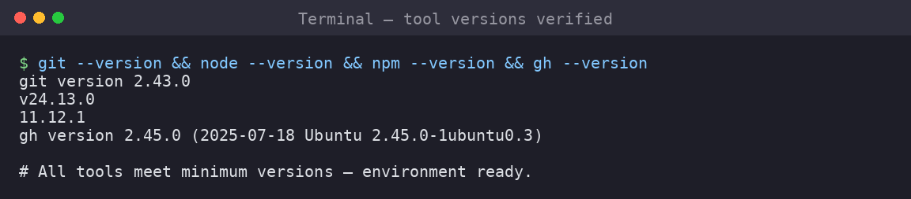
*Verifikasi versi Node.js, NPM, dan MySQL.*

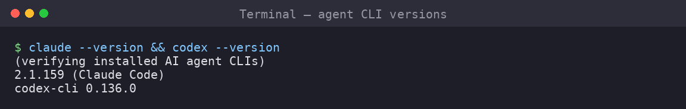
*Verifikasi instalasi Gemini CLI Agent.*

### 2. Perencanaan Proyek (Discuss & Plan)
Menggunakan GSD Core untuk mendefinisikan *Project Spec* dan *Roadmap* sebelum penulisan kode dimulai, memastikan arah pengembangan sesuai target.
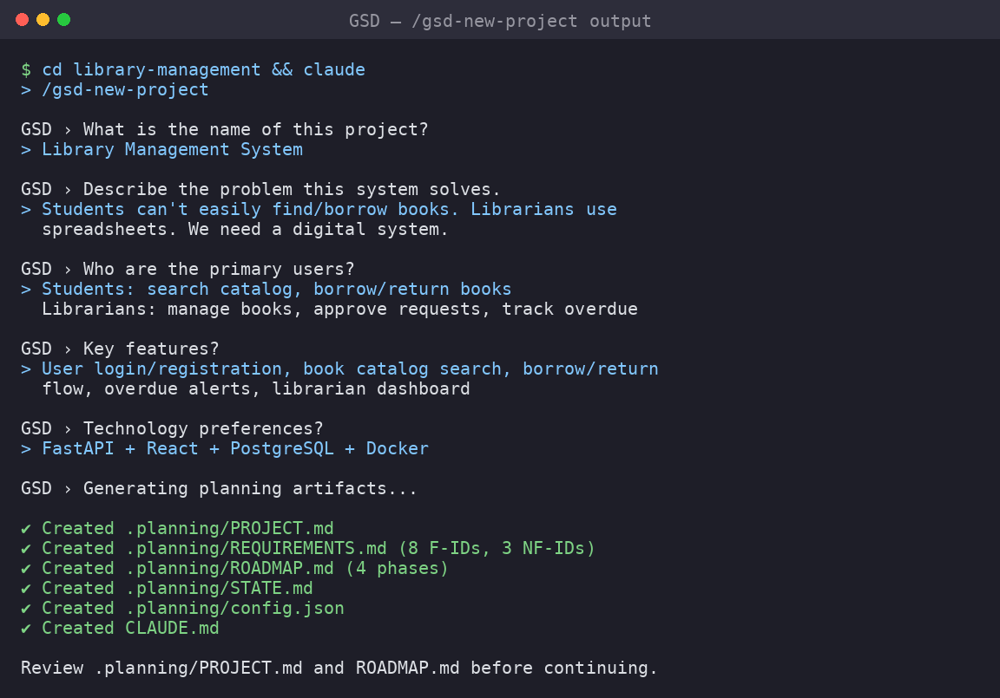
*Inisialisasi proyek menggunakan asisten GSD.*

### 3. Eksekusi Agen (Execute)
Agen AI bekerja secara kolaboratif untuk mengimplementasikan fitur-fitur sesuai dengan perencanaan yang telah disetujui, menangani logika backend hingga komponen antarmuka.
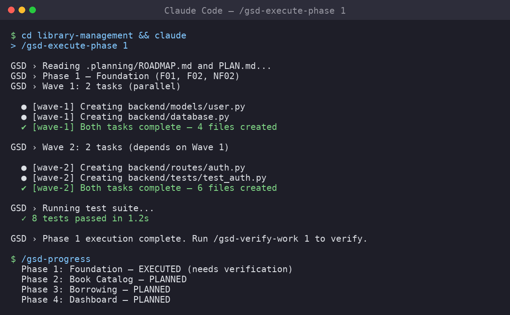
*Proses implementasi logika server oleh agen AI.*

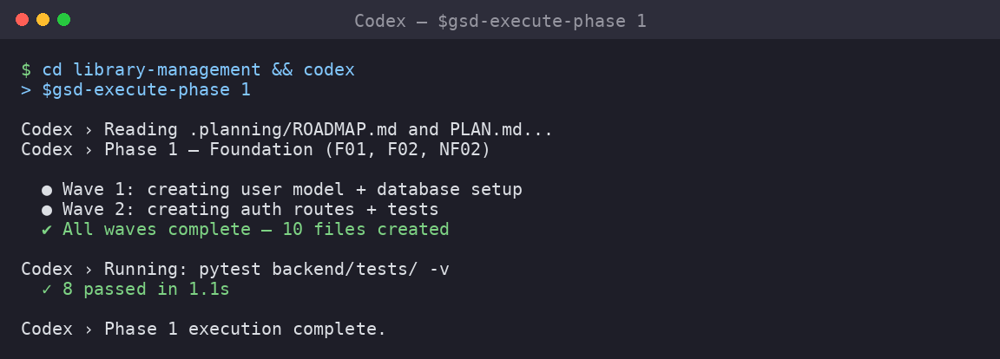
*Pengembangan komponen UI dan integrasi frontend.*

### 4. Verifikasi & Delivery (Verify & Ship)
Setiap perubahan divalidasi melalui pengujian manual dan review oleh AI sebelum digabungkan ke cabang utama untuk menjamin standar kualitas.
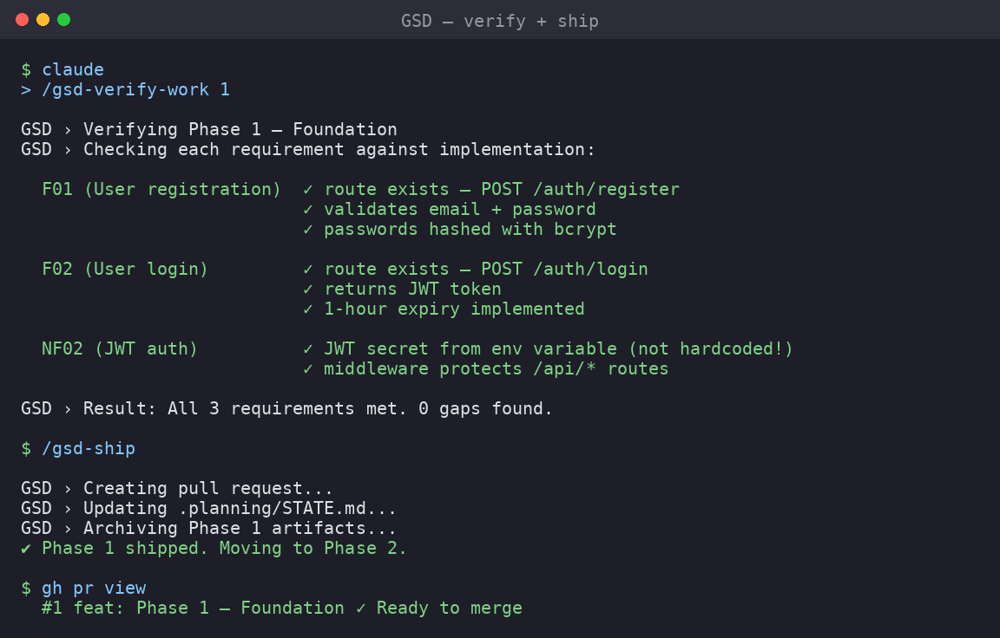
*Proses verifikasi akhir dan persiapan deployment.*

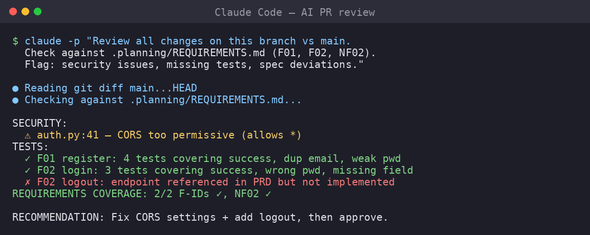
*Review kode melalui asisten AI untuk memastikan kepatuhan terhadap standar industri.*

---

## 📂 Struktur Folder

```text
isd-project/
├── .planning/           # Dokumen perencanaan GSD Core (PRD, Specs, Roadmap)
├── assets/              # Dokumentasi visual dan screenshots
├── client/              # Frontend React (Vite)
│   ├── src/
│   │   ├── components/  # Reusable UI components
│   │   ├── context/     # AuthContext & State management
│   │   ├── pages/       # Dashboard, Login, Manager pages
│   │   └── services/    # API calls configuration
├── server/              # Backend Node.js + Express
│   ├── config/          # Database connection
│   ├── controllers/     # Business logic
│   ├── middleware/      # Auth & Role verification
│   ├── routes/          # API endpoints definition
└── docs/                # Dokumentasi teknis tambahan (SQL Schema, API Docs)
```

## ⚙️ Cara Instalasi

### 1. Prasyarat
- Node.js (v18+)
- MySQL Server (XAMPP / Laragon / Docker)

### 2. Setup Database
1. Jalankan MySQL Server Anda.
2. Buat database baru bernama `lms_db`.
3. Import schema dari file `docs/sql/schema.sql`.

### 3. Konfigurasi Environment
Buat file `server/.env` dan sesuaikan dengan konfigurasi lokal Anda:
```bash
DB_HOST=localhost
DB_USER=root
DB_PASS=your_database_password
DB_NAME=lms_db
JWT_SECRET=your_secure_jwt_secret_key
PORT=5000
```

---

## 🏃‍♂️ Menjalankan Aplikasi

### Menjalankan Backend
```bash
cd server
npm install
npm run dev
```
*Server akan berjalan di `http://localhost:5000`*

### Menjalankan Frontend
```bash
cd client
npm install
npm run dev
```
*Aplikasi web dapat diakses di `http://localhost:3000`*

---

## 🔑 Akun Demo

| Role | Username | Password |
| :--- | :--- | :--- |
| **Admin** | `admin` | `admin123` |
| **Pustakawan** | `pustakawan` | `pustakawan123` |
| **Anggota** | `anggota` | `anggota123` |

---

## 🗄️ Database Demo

Sistem menggunakan database relasional MySQL dengan struktur yang dioptimalkan untuk performa dan integritas data. Skema meliputi tabel pengguna, buku, dan transaksi peminjaman.

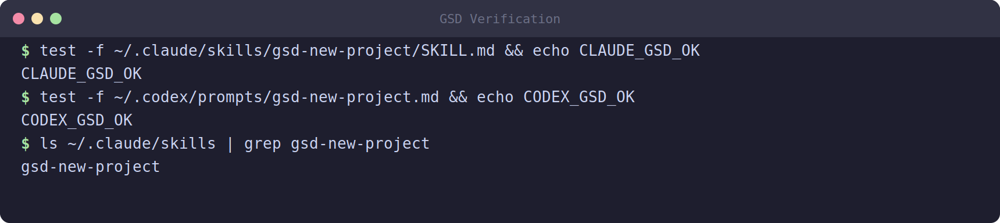
*Verifikasi status database dan koneksi sistem.*

---

## 📷 Dokumentasi Antarmuka (UI)

Berikut adalah tampilan antarmuka aplikasi Library Management System:

<p align="center">
  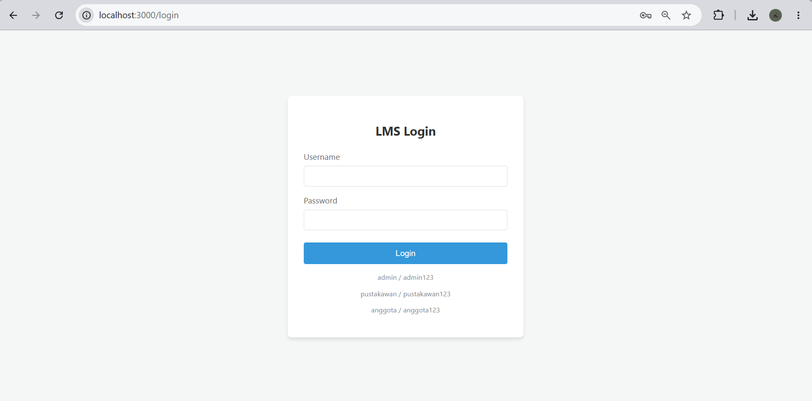
  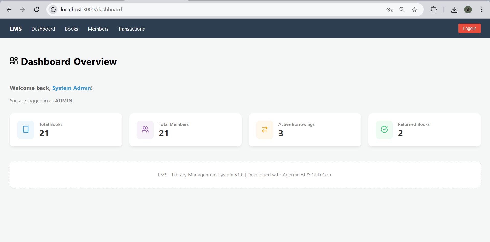
</p>
<p align="center"><em>Halaman Login (Kiri) dan Dashboard Statistik (Kanan).</em></p>

<p align="center">
  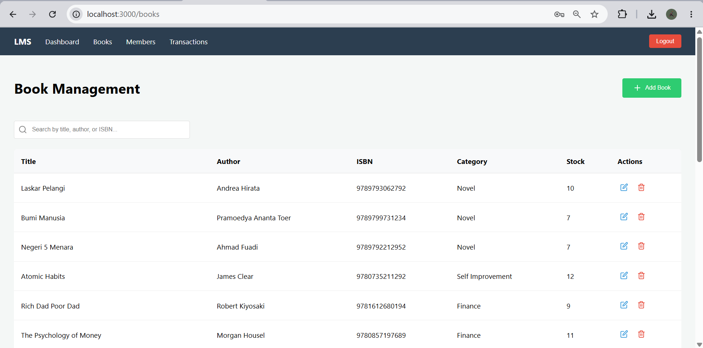
  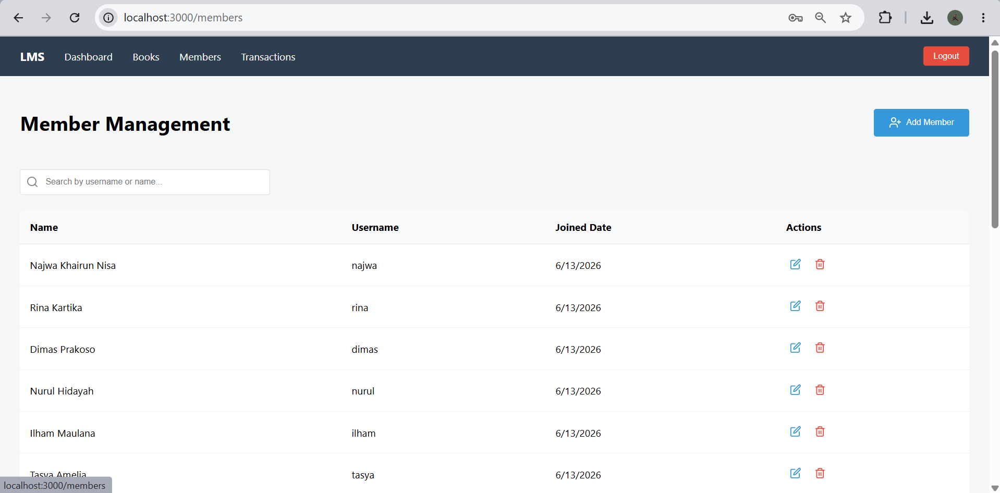
</p>
<p align="center"><em>Manajemen Buku (Kiri) dan Manajemen Anggota (Kanan).</em></p>

<p align="center">
  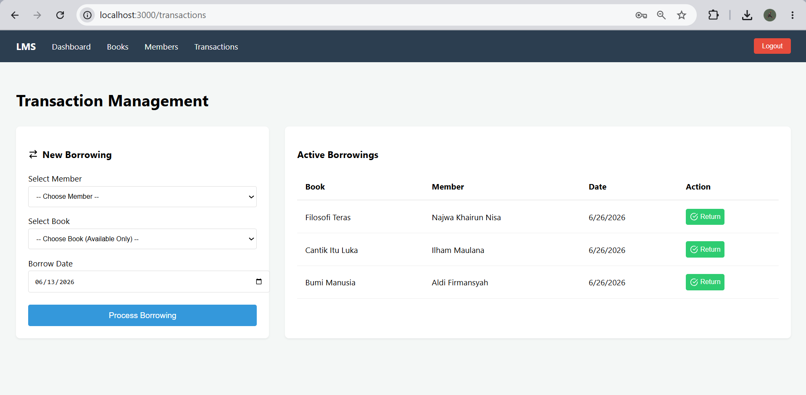
</p>
<p align="center"><em>Alur Transaksi Peminjaman dan Pengembalian Buku.</em></p>

---

## 🛣️ API Endpoints Utama

### Auth
- `POST /api/v1/auth/login` - Autentikasi pengguna dan perolehan token JWT.

### Books
- `GET /api/v1/books` - Mengambil daftar seluruh koleksi buku.
- `POST /api/v1/books` - Menambahkan koleksi buku baru (Admin/Pustakawan).

### Transactions
- `POST /api/v1/transactions/borrow` - Mencatat transaksi peminjaman baru.
- `PUT /api/v1/transactions/:id/return` - Memproses pengembalian buku berdasarkan ID transaksi.
- `GET /api/v1/transactions/history` - Melihat riwayat transaksi pengguna yang bersangkutan.

---

**Library Management System - Version 1.0.0**  
*Proyek ini dikembangkan dengan pendekatan modern menggunakan Agentic AI workflows untuk efisiensi dan kualitas kode yang optimal.*
