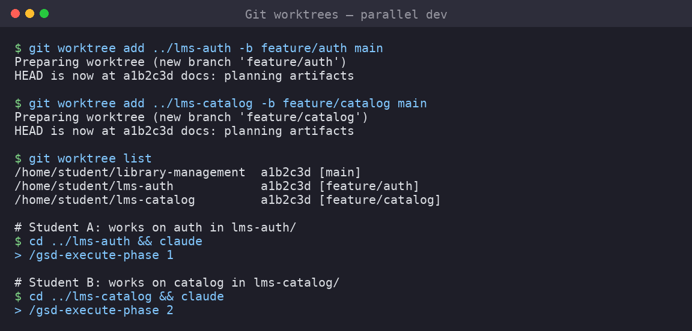

# 09 — Team Collaboration with Git Worktrees

## The Problem: One Repo, Many Workers

Imagine your team of three (let's call them Anda, Budi, and Cici) is building a Library Management System with ISD. Anda is working on user authentication (Phase 2). Budi is building the book catalog (Phase 1). Cici is setting up the borrowing system (Phase 3).

Each of you wants to run an AI agent session simultaneously. Each agent needs its own working directory — it creates files, runs tests, installs dependencies, and makes commits. But your project is in a single Git repository.

How do you share one repo without stepping on each other's toes?

### The Wrong Answer: One Machine, One Directory

If you all SSH into the same machine and try to work in one directory:

- Anda's agent creates `backend/auth.py` — but Budi's agent was about to create `backend/models/book.py` and now the directory is full of auth code
- Cici's agent runs tests and they fail because Anda's partial auth code is missing a dependency
- Someone accidentally overwrites someone else's file
- You can't even `git checkout` different branches without stashing work

### A Better Answer: Separate Machines/Containers

Each person works on their own machine or container. This works but adds overhead:

- You need to sync changes constantly
- The database setup is duplicated
- Environment differences cause "works on my machine" problems
- The AI agent tools and configurations need to be replicated

### The Best Answer: Git Worktrees

**Git worktrees** let you have multiple working directories from a single local repository, each on a different branch. Think of it as `git checkout` without the "lose your current state" part — you can have the `auth` branch checked out in `~/projects/library/auth-worktree/` and the `catalog` branch checked out in `~/projects/library/catalog-worktree/` simultaneously.

```
            ┌── /projects/library/main/           (main branch)
            │
repo.git ───┼── /projects/library/worktrees/auth/   (feature/phase-02-auth)
            │
            ├── /projects/library/worktrees/catalog/ (feature/phase-01-catalog)
            │
            └── /projects/library/worktrees/borrow/  (feature/phase-03-borrowing)
```

Each worktree is a complete working copy. Each has its own `node_modules/`, its own `.venv/`, its own files. But they all share the same `.git/` directory — so commits from any worktree are instantly available to all others.

## How Git Worktrees Work

### Creating a Worktree

```bash
# From your main repository
cd ~/projects/library-system

# Create a worktree for the auth feature
git worktree add ~/projects/library-system-worktrees/auth feature/phase-02-auth

# Create a worktree for the catalog feature
git worktree add ~/projects/library-system-worktrees/catalog feature/phase-01-catalog

# Create a worktree for a new branch (NOT yet existing)
git worktree add -b feature/phase-03-borrowing ~/projects/library-system-worktrees/borrow
```

After these commands, you have three new directories, each with the corresponding branch checked out.

### Listing Worktrees

```bash
git worktree list
```

Output:

```
/home/user/projects/library-system                  main
/home/user/projects/library-system-worktrees/auth    feature/phase-02-auth
/home/user/projects/library-system-worktrees/catalog feature/phase-01-catalog
/home/user/projects/library-system-worktrees/borrow  feature/phase-03-borrowing
```

### Removing a Worktree

When Anda finishes Phase 2 and merges it to main, she removes her worktree:

```bash
# From anywhere
git worktree remove ~/projects/library-system-worktrees/auth

# Or from within the worktree directory
cd ~/projects/library-system-worktrees/auth
git worktree remove .
```

After removing, the directory is deleted. The branch still exists in the repo — you just don't need a separate working copy anymore.

### Important Rules

1. **You cannot remove a worktree with uncommitted changes** (Git protects you).
2. **You cannot check out a branch in the main repo that's already checked out in a worktree**.
3. **Worktrees share the same `.git` directory** — `git log`, `git push`, `git fetch` work from any worktree and affect all.
4. **Uncommitted work in one worktree does not affect others** — they are truly independent.

## The ISD Team Pattern

Here's the recommended pattern for a 3-person team using ISD with git worktrees.

### Setup

```bash
# 1. Clone the repo once
git clone https://github.com/your-team/library-system.git ~/projects/library-system/main

# 2. Create worktrees for each person
cd ~/projects/library-system/main

# Anda's worktree
git worktree add -b feature/phase-02-auth ~/projects/library-system-and/auth

# Budi's worktree
git worktree add ~/projects/library-system-budi/catalog feature/phase-01-catalog

# Cici's worktree
git worktree add -b feature/phase-03-borrowing ~/projects/library-system-cici/borrow
```

### Each Person's Workflow

Each team member works in their own worktree directory. They each run their own ISD agent session.

**Anda (auth phase):**

```bash
# In her worktree
cd ~/projects/library-system-and/auth

# Activate her own virtual environment
python3 -m venv .venv
source .venv/bin/activate

# Install her dependencies
pip install -r requirements.txt

# Run her ISD session
/gsd-discuss-phase 2
/gsd-plan-phase 2

# The agent creates files in this worktree only
# When ready, commit and push
git add -A
git commit -m "feat: implement user registration and login"
git push -u origin feature/phase-02-auth
```

**Budi (catalog phase):**

```bash
# In his worktree
cd ~/projects/library-system-budi/catalog

# His own environment
python3 -m venv .venv
source .venv/bin/activate

# The catalog commit history is independent
git add -A
git commit -m "feat: add book catalog CRUD"
git push -u origin feature/phase-01-catalog
```

**Cici (borrowing phase):**

```bash
cd ~/projects/library-system-cici/borrow

python3 -m venv .venv
source .venv/bin/activate

# She may need to pull from the main branch
git fetch origin
git merge origin/feature/phase-02-auth  # merge auth changes

git add -A
git commit -m "feat: implement book borrowing flow"
```

### Merging When Ready

When a phase is complete and reviewed:

```bash
# From the main repo
cd ~/projects/library-system/main

# Merge Budi's catalog first
git merge feature/phase-01-catalog

# Merge Anda's auth (may need to resolve conflicts)
git merge feature/phase-02-auth

# Push to main
git push origin main

# Delete merged branches
git branch -d feature/phase-01-catalog
git branch -d feature/phase-02-auth

# Remove worktrees
git worktree remove ~/projects/library-system-budi/catalog
git worktree remove ~/projects/library-system-and/auth

# Sync remaining worktrees
cd ~/projects/library-system-cici/borrow
git pull origin main
```

## Handling Merge Conflicts

Conflicts happen when two worktrees modify the same file. Here's how to deal with them.

### Prevention: Communication

Before starting work, agree on file ownership:

| File | Owner |
|---|---|
| `backend/auth/` | Anda |
| `backend/catalog/` | Budi |
| `backend/borrowing/` | Cici |
| `backend/models/` | Shared (discuss before editing) |
| `frontend/pages/` | Shared by component |

Clear ownership reduces conflicts to near zero.

### When Conflicts Happen

```bash
# From the main repo
cd ~/projects/library-system/main
git merge feature/phase-02-auth

# If conflict in backend/models/user.py:
# Edit the file, resolve markers (<<<<<<<, =======, >>>>>>>)
# Or use: git mergetool

git add backend/models/user.py
git commit
```

### Using Merge Tools

```bash
# Set up a merge tool (vimdiff, VS Code, etc.)
git config merge.tool vscode
git config mergetool.vscode.cmd 'code --wait "$MERGED"'

# Then
git mergetool
```

## Worktrees vs. Alternatives

| Approach | Pros | Cons |
|---|---|---|
| **Git worktrees** | Single repo, independent dirs, shared Git state | All on one machine |
| **Separate repos** | Truly independent | No shared Git history, hard to merge |
| **Feature flags** | All code in one branch | Complex, not for beginners |
| **Mono-repo tooling** | Professional pattern | Overkill for student projects |
| **Docker containers** | Isolated environments | Heavy setup, networking complexity |

For student teams building a single project, git worktrees offer the best balance of simplicity and power.

## Practical Tips

### Tip 1: Use a Consistent Worktree Layout

Pick a convention and stick with it:

```
/mnt/c/Users/YourName/projects/library-system/
├── main/          # The main repo (main branch)
└── worktrees/
    ├── anda/      # Anda's worktree
    ├── budi/      # Budi's worktree
    └── cici/      # Cici's worktree
```

Or, if you want each person's worktree in their own user directory:

```
/home/anda/projects/library-system/
/home/budi/projects/library-system/
/home/cici/projects/library-system/
```

The location doesn't matter as long as everyone knows where things are.

### Tip 2: Prefix Branches with Person Name

```bash
git worktree add -b anda/phase-02-auth /home/anda/projects/library-system
git worktree add -b budi/phase-01-catalog /home/budi/projects/library-system
```

This makes it clear who owns which branch.

### Tip 3: Periodically Sync with Main

```bash
# Inside any worktree
git fetch origin
git merge origin/main
```

Do this at least daily to keep conflicts small and manageable.

### Tip 4: Each Worktree Gets Its Own Environment

```
worktrees/anda/
├── .venv/           ← Python venv for Anda
├── node_modules/    ← Node modules (if using JS)
└── ...

worktrees/budi/
├── .venv/           ← Separate Python venv
├── node_modules/
└── ...
```

This means Anda can install different packages without breaking Budi's setup. Just be aware of disk space — those environments can be large.

### Tip 5: Shared Database

For development, it's often useful to have a single database that all worktrees point to. Set the `DATABASE_URL` in each worktree's `.env` file:

```bash
# worktrees/anda/.env
DATABASE_URL=postgresql://localhost:5432/library_dev

# worktrees/budi/.env (same database)
DATABASE_URL=postgresql://localhost:5432/library_dev
```

When Anda runs migrations, the schema changes are visible to Budi's worktree too. This is usually fine — just communicate before running destructive migrations.

## Screenshots



## Complete Example

Here's the full lifecycle of a team using worktrees for one sprint:

```bash
# ── DAY 1: Setup ──────────────────────────────────────

# Team lead clones the repo
git clone https://github.com/team/library.git ~/projects/library/main
cd ~/projects/library/main

# Creates worktrees for each team member
git worktree add -b anda/phase-02-auth ~/projects/library/worktrees/anda
git worktree add -b budi/phase-01-catalog ~/projects/library/worktrees/budi
git worktree add -b cici/phase-03-borrowing ~/projects/library/worktrees/cici

# Push new branches to GitHub
git push -u origin anda/phase-02-auth
git push -u origin budi/phase-01-catalog
git push -u origin cici/phase-03-borrowing

# ── DAY 1-5: Parallel Work ────────────────────────────

# Anda works on auth (in her worktree)
cd ~/projects/library/worktrees/anda
# Runs /gsd-discuss-phase 2, /gsd-plan-phase 2
# Agent creates auth models, views, templates
git add -A && git commit -m "feat: add User model and registration"
git push

# Budi works on catalog (in his worktree)
cd ~/projects/library/worktrees/budi
# Runs /gsd-discuss-phase 1, /gsd-plan-phase 1
# Agent creates book models and CRUD
git add -A && git commit -m "feat: book Catalog CRUD"
git push

# Cici works on borrowing (in her worktree)
cd ~/projects/library/worktrees/cici
# Runs /gsd-discuss-phase 3, /gsd-plan-phase 3
# Creates borrowing models
git add -A && git commit -m "feat: Loan model and schema"
# Merges latest main
git fetch origin && git merge origin/anda/phase-02-auth
git push

# ── DAY 6: Review & Merge ─────────────────────────────

# Team lead reviews PRs
gh pr review <pr-number> --approve
gh pr merge <pr-number> --merge

# Or merge locally
cd ~/projects/library/main
git merge anda/phase-02-auth
git merge budi/phase-01-catalog
git push origin main

# Clean up old worktrees
git worktree remove ~/projects/library/worktrees/anda
git branch -d anda/phase-02-auth

# ── DAY 7: Next Sprint ───────────────────────────────

# Create new worktrees for Phase 4 and 5
git worktree add -b anda/phase-04-reports ~/projects/library/worktrees/anda
git worktree add -b budi/phase-05-notifications ~/projects/library/worktrees/budi
```

## Summary

| Command | Purpose |
|---|---|
| `git worktree add <path> <branch>` | Create a new worktree |
| `git worktree add -b <new-branch> <path>` | Create a new branch + worktree |
| `git worktree list` | Show all worktrees |
| `git worktree remove <path>` | Remove a worktree |
| `git worktree prune` | Clean up stale worktree metadata |

**Key takeaway**: Git worktrees let your team work in parallel without stepping on each other's toes, while keeping everyone on the same Git repository. Each person gets their own directory, their own branch, and their own agent session — all sharing the same source of truth.

**Next**: With your workflow set up, you're ready to start executing phases. Remember the cycle: **Discuss → Plan → Execute → Review → Merge**. Repeat for each phase until your project is complete.

➡️ Continue to [10 — Building with Claude Code](10-build-with-claude.md)
